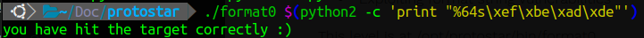

# format 0

## source code 

```C
#include <stdlib.h>
#include <unistd.h>
#include <stdio.h>
#include <string.h>

void vuln(char *string)
{
  volatile int target;
  char buffer[64];

  target = 0;

  sprintf(buffer, string);
  
  if(target == 0xdeadbeef) {
      printf("you have hit the target correctly :)\n");
  }
}

int main(int argc, char **argv)
{
  vuln(argv[1]);
}
```

## solution 

chỉ cần overflow biến target là được, ở đây dùng format string sẽ giúp bạn tạo payload dễ hơn

 