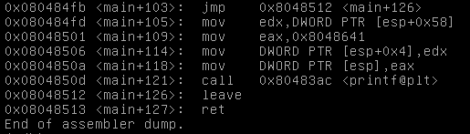

# stack2

## description

Chạy thử chương trình thì báo lỗi vì chưa cài đặt biến môi trường tên `GREENIE`. Cùng ngó thử qua hàm main nhé.

Đọc qua ta thấy ngay lấy giá trị của biến môi trường `GREENIE(0x80485e0)` gán vào biến `variable([esp+0x5c])`. Sau đó, dùng strcpy để đưa giá trị từ `variable` tức là `GREENIE` vào `buf([esp+0x18])`. Cuối cùng so sánh giá trị ở biến `modified([esp+0x58])` với 0xd0a0d0a. Vậy ta cần tìm cách để cho `modified = 0xd0a0d0a`.

## Solution

### Buffer overflow

biến `modified` ở sau `buf`, nên phần `padding: 0x58-0x18 = 0x40`. bây giờ mình tạo một `environment variable` có tên là `GREENIE` nằm trong cùng đường dẫn với source. Như sau:

`export GREENIE=`python -c ‘print “A”*64 + “x0ax0dx0ax0d”’` `
